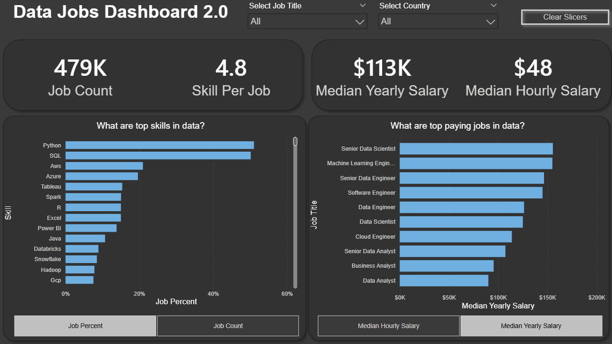

# 📊 Data Jobs Dashboard (V2 – Advanced)

## 📌 Project Overview

The **Data Jobs Dashboard (V2)** is an enhanced and more advanced version of my original Data Jobs dashboard.  
It builds on the foundational analysis by introducing **improved KPIs, deeper insights, and stronger interactivity**, with a clear focus on **business-driven decision support**.

This version reflects my progression in:
- Power BI dashboard design
- DAX measures
- Data storytelling
- User experience (UX)

---

## 🎯 Business Objective

To analyze the **data job market** by answering key questions such as:
- Which data roles are most in demand?
- What skills are required for each role?
- How do salaries vary by role, skills, and location?
- How can job seekers or decision-makers identify market trends?

---

## 📂 Dataset Overview

The dataset includes information related to:
- Data-related job titles
- Required technical skills
- Salary ranges (hourly and yearly)
- Job locations
- Job counts and distributions

The data is transformed and modeled using **Power Query** and **Power BI relationships**.

---

## 📈 Key KPIs & Metrics

This dashboard includes KPIs such as:
- **Total Job Count**
- **Average Skills per Job**
- **Median Yearly Salary**
- **Median Hourly Salary**

All KPIs are calculated using **DAX measures** to ensure accuracy and flexibility.

---

## 🧮 DAX & Data Modeling

Key highlights:
- Custom DAX measures for salary and job metrics
- Aggregations optimized for slicer interaction
- Clean star-style data modeling for performance

---

## 🎨 Dashboard Design & Interactivity

Design improvements in V2 include:
- KPI cards with clean layout and visual hierarchy
- Interactive slicers for:
  - Job titles
  - Skills
  - Locations
- Improved alignment, spacing, and readability
- Shape-based backgrounds for professional UI styling

Here’s a preview of the dashboard:

The dashboard is designed to be **intuitive, interactive, and insight-focused**.

---

## 🔍 Key Insights Enabled

Users can:
- Compare salaries across job roles
- Identify high-demand skills per role
- Explore job distribution by country
- Analyze how skills impact salary levels

---

## 🚀 Version Improvements Over V1

| Area | V1 | V2 |
|----|----|----|
| KPIs | Basic | Enhanced & refined |
| Interactivity | Limited | Advanced slicers & filtering |
| Design | Simple | Professional dashboard layout |
| Insights | Descriptive | More analytical & actionable |

---

## 🧠 Key Learnings

- Advanced KPI design in Power BI
- Better DAX structuring
- Dashboard UX best practices
- Business-oriented data storytelling
