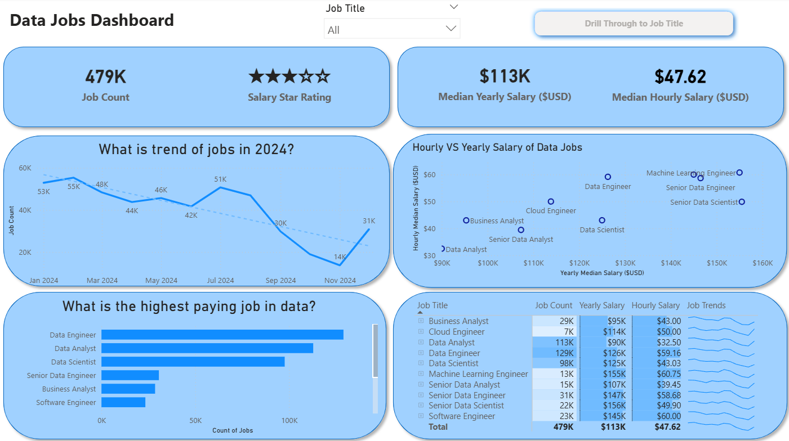

# 📊 Data Jobs Market Analysis Dashboards (Power BI)

## 📌 Project Overview
This repository showcases an end-to-end analysis of the **global data jobs market** using **Power BI**, presented through two versions of an interactive dashboard.

The project highlights my progression in **data analytics, dashboard design, and business intelligence**, moving from foundational insights (**V1**) to a more advanced, business-focused solution (**V2**).

---

## 🚀 Repository Structure
📁 Data_Jobs_V1/ → Foundational dashboard (core analysis)

📁 Data_Jobs_V2/ → Advanced dashboard (enhanced insights & UX)

📁 images/ → Dashboard screenshots

---

## 🔹 Dashboard Versions

### 📊 Version 1 — Foundational Analysis
The first version focuses on **core exploration of the data job market**, including:

- Job role distribution  
- Salary trends by role and experience  
- Geographic job distribution  
- Employment type comparisons  
- Interactive filtering and drill-through  

👉 This version demonstrates:
- Data cleaning using Power Query  
- Basic DAX measures  
- Fundamental dashboard design  
- Descriptive analytics  

📁 Navigate to: `Data_Jobs_V1`

---

### 📈 Version 2 — Advanced Dashboard
The second version is a **significant upgrade**, focusing on **deeper insights and better user experience**.

Enhancements include:
- Advanced KPIs (e.g., average skills per job)  
- Improved DAX calculations and data modeling  
- Interactive slicers (skills, roles, locations)  
- Cleaner, more professional UI/UX  
- More analytical and actionable insights  

👉 This version demonstrates:
- Advanced Power BI techniques  
- Business-driven data storytelling  
- Optimized dashboard performance  

📁 Navigate to: `Data_Jobs_V2`

---

## 🔄 Evolution from V1 → V2

| Area | V1 | V2 |
|------|----|----|
| Analysis | Descriptive | Analytical & Insight-driven |
| KPIs | Basic | Advanced & dynamic |
| Interactivity | Limited | Enhanced slicers & filtering |
| Design | Simple | Professional UI/UX |
| Focus | Exploration | Decision support |

---

## 🛠 Tools & Technologies
- **Power BI Desktop**
- **Power Query**
- **DAX (Data Analysis Expressions)**
- **Data Modeling**
- **Data Visualization & Dashboard Design**

---

## 🎯 Key Objectives
This project aims to:
- Analyze **global data job market trends**
- Identify **high-demand roles and skills**
- Explore **salary distributions**
- Provide **interactive insights for decision-making**

---

## 🧠 Skills Demonstrated
- Data cleaning and transformation  
- Data modeling and DAX  
- Dashboard design and storytelling  
- KPI development  
- Business-oriented analytics  

---

## 📸 Dashboard Preview

---

## 💡 How to Use
1. Choose a version (**V1** or **V2**)  
2. Navigate to its folder  
3. Download the `.pbix` file  
4. Open using **Power BI Desktop**  

---

## 📄 License
This project is licensed under the **MIT License**, meaning you are free to use, modify, and distribute this project with proper attribution.

See the `LICENSE` file for more details.

---

## 📬 Final Note
This project reflects my growth in **data analytics and Power BI**, showcasing how I transform raw data into **insightful, interactive dashboards**.
